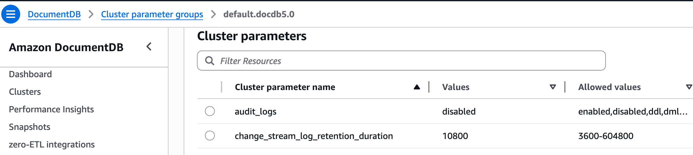
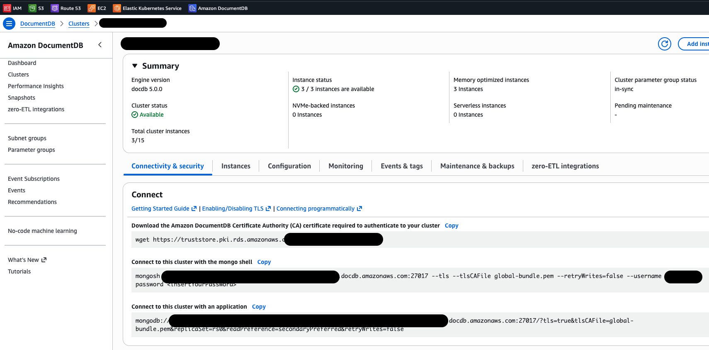

# docMongoStream: Migration & Sync Tool

~~~~~~~~~~~~~~~~~~~~~~~~~~~~~~~~~~~~~~~~~~~~~~~~~~~~~~~~~~~~~~~~~~~~~~~~~~~~~~~~~~~~~~~~~~~~~~~~~~~~~~~~~~~
________            ______  ___                                ____________                               
___  __ \______________   |/  /___________________ ______      __  ___/_  /__________________ _______ ___ 
__  / / /  __ \  ___/_  /|_/ /_  __ \_  __ \_  __ `/  __ \     _____ \_  __/_  ___/  _ \  __ `/_  __ `__ \
_  /_/ // /_/ / /__ _  /  / / / /_/ /  / / /  /_/ // /_/ /     ____/ // /_ _  /   /  __/ /_/ /_  / / / / /
/_____/ \____/\___/ /_/  /_/  \____//_/ /_/_\__, / \____/      /____/ \__/ /_/    \___/\__,_/ /_/ /_/ /_/ 
                                           /____/      
~~~~~~~~~~~~~~~~~~~~~~~~~~~~~~~~~~~~~~~~~~~~~~~~~~~~~~~~~~~~~~~~~~~~~~~~~~~~~~~~~~~~~~~~~~~~~~~~~~~~~~~~~~~ 

docMongoStream automates the complete, end-to-end migration from an Amazon DocumentDB cluster to any self-managed MongoDB instance. It is a high-performance tool written in Go for performing a full data load and continuous data capture (CDC) migrations. It provides a resilient, two-phase migration process:

* Full Sync: A parallelized, high-speed copy of all existing data from source collections.
* Continuous Sync (CDC): Opens a change stream on the source DocumentDB to capture all inserts, updates, deletes and DDLs (with a few exceptions), applying them in batches to the target MongoDB for real-time synchronization.

## Prerequisites

### DocumentDB Pre-Setup

You MUST enable change streams on your source DocumentDB cluster, change streams might not be enabled by default. To enable them, you must modify your DocumentDB cluster parameter group: 

1. Find your Cluster Parameter Group:
    * Go to the AWS DocumentDB console.
    * Click on your cluster's name.
    * On the "Configuration" tab, find the "Cluster parameter group" 

2. Modify the Parameter Group:
    * Go to the "Parameter groups" section in the DocumentDB console.
    * Click on the parameter group your cluster is using.
    * Select the change_stream_log_retention_duration parameter and click "Modify".
    * Set the "Value" to the desired retention time. AWS recommends 24 hours or more. This value is in milliseconds.
        * 24 hours: 86400000
        * 7 days: 604800000
    * Save the changes.



| Database | Action Required | Command (Mongo Shell) |
| :--- | :--- | :--- |
| **DocumentDB (Source)** | **A. Download CA Certificate** | Go to your AWS account and download the CA Cert |
| **Source and Target** | **B. Ensure both are running and you are able to connect** | Ensure the service is active and listening on the configured IP/port. Make sure any firewall rules have also been configured accordingly and you are able to connect to both clusters from the host running docMongoStream |
| **DocumentDB (Source)** | **C. ENABLE CHANGE STREAMS IN DOCUMENTDB** | This might need to be done for each collection depending on your use case. |

You can obtain the DocumentDB AWS CA cert for your cluster by going to the AWS console and browsing to DocumentDB --> Clusters --> <cluster_name_here> and then click on the `Connectivity & Security` tab (sample screenshot below). This is also where you need to gather your DocumentDB URI, in order to configure it in the `config.yaml`.



#### How to enable change streams in DocumentDB

docMongoStream was designed to run these checks for you automatically, but it does not make these changes for you. 
DocumentDB requires change streams to be explicitly enabled. Once you have modified the parameter groups accordingly you can then proceed to enabling the Cluster Stream. Connect to your DocumentDB cluster via a mongo shell and run the command below to enable the cluster-wide stream in your DocumentDB cluster:

```bash
use admin;
db.adminCommand({
  modifyChangeStreams: 1,
  database: "",
  collection: "",
  enable: true
});
```

The command below would only enable them for the 3 collections shown:

```bash
use admin;
db.adminCommand({modifyChangeStreams: 1, database: "percona_db_1", collection: "test_1", enable: true});
db.adminCommand({modifyChangeStreams: 1, database: "percona_db_1", collection: "test_2", enable: true});
db.adminCommand({modifyChangeStreams: 1, database: "percona_db_1", collection: "test_3", enable: true});
```

## Installing docMongoStream

### The easy way

All you need to do is follow 3 steps:

1. Download the binary (compiled for linux amd64) from the [bin](./bin) folder
2. Download the [config.yaml](./config.yaml) 
3. Follow the rest of the instructions below

### The hard way

You might want to compile docMongoStream for a different architecture (not tested) other than linux, so in order to do that you will just need to follow a few steps:

1. Clone this repo
2. Make whatever changes to the application you want (not required)
3. Build it for your specific architecture, examples below:

Build for linux

```bash
GOOS=linux GOARCH=amd64 go build -o ./bin/docMongoStream ./cmd/docMongoStream/
```

Build for your current OS and Architecture
```bash
go build -o ./bin/docMongoStream ./cmd/docMongoStream/
```

## Configure Users

You need to create users in both source and destination environments, you can name them whatever you like:

***Source (DocumentDB)***

```sql
db.getSiblingDB('admin').createUser({
  user: 'streamer',
  pwd: 'superSecretPassword',
  roles: ['clusterMonitor', 'readAnyDatabase']
});
```

***Destination (MongoDB)***

```sql
db.getSiblingDB('admin').createUser({
   user: 'streamer',
   pwd: 'superSecretPassword',
   roles: ['restore', 'clusterMonitor', 'clusterManager','readWriteAnyDatabase']
  });
```  

## Configuring docMongoStream

The application is configured via the [config.yaml](./config.yaml) file in the application's root directory. You will need to at the very least edit the source and destination parameters. 

```yaml
# Source DocumentDB
docdb:
  endpoint: "localhost"
  port: "7777"
  ca_file: "/home/daniel.almeida/global-bundle.pem"
  # If true, tlsAllowInvalidHostnames=true will be added to the connection string.
  tls_allow_invalid_hostnames: true
  extra_params: ""

# Target MongoDB
mongo:
  endpoint: "dan-ps-lab-mongos00.tp.int.percona.com"
  port: "27017"
  ca_file: ""
  tls_allow_invalid_hostnames: true 
  extra_params: ""
```  

docMongoStream configuration options are self explanatory and documented within the configuration file itself. The only parameters you have to pass to the application at runtime are the usernames for the source and destination environments, the passwords for each are interactive and you will be prompted for it accordingly. You can also configure environment variables so you don't have to type them if you prefer, the choice is yours.

### Credentials

Credentials for the source and target databases are required. They can be provided in three ways, in order of priority:

1. Flags (Highest Priority):
    * `--docdb-user <user>`
    * `--mongo-user <user>`

2. Environment Variables:
    * `MIGRATION_DOCDB_USER`: Username for the source DocumentDB.
    * `MIGRATION_DOCDB_PASS`: Password for the source DocumentDB user.
    * `MIGRATION_MONGO_USER`: Username for the target MongoDB.    
    * `MIGRATION_MONGO_PASS`: Password for the target MongoDB user.

    ***Note about env vars*** You can change the prefix (`MIGRATION`) by setting `migration.env_prefix` in the `config.yaml`.

3. Interactive Prompt (Lowest Priority):
    * If passwords (`MIGRATION_DOCDB_PASS`, `MIGRATION_MONGO_PASS`) are not set as environment variables, the start command will securely prompt you to enter them. This is the recommended approach. You can not provide passwords as command line arguments for security purposes.

```bash
./docMongoStream help
docMongoStream is a tool for performing a full load and continuous data
capture (CDC) migration from AWS DocumentDB to MongoDB.

Usage:
  docMongoStream [command]

Available Commands:
  help        Help about any command
  start       Starts the full load and CDC migration
  status      Checks and prints the current status of the migration
  stop        Finds the running application and stops it

Flags:
      --docdb-user string   Source DocumentDB Username
  -h, --help                help for docMongoStream
      --mongo-user string   Target MongoDB Username

Use "docMongoStream [command] --help" for more information about a command.
```

### Customization

docMongoStream can fully synchronize the source and destination clusters, and it also allows you to configure some aspects of the migration through its config.yaml file.

1. Exclude databases

You are able to exclude entire databases (the ones below are recommended and should not be synced). You can add any other database to the list below and it will be skipped:

```yaml
  exclude_dbs:
    - "admin"
    - "local"
    - "config"
```

2. Exclude collections

You can exclude specific collections from the migration; however, if you intend to skip all collections within a particular database, use exclude_dbs instead.
Use the format "dbname.collname", and separate multiple entries with commas.

```yaml
exclude_collections: []  
```

3. Destroy destination databases

Set this value to true if you want to restart the migration from scratch. Doing so will drop all databases and collections in the destination environment except for the admin, local, and config databases, as well as any other databases that were not originally synchronized from the source. In other words, if a database does not exist on the source, it will not be dropped.

```yaml
destroy: False
```

4. Dry run mode

Set the following to True if you do not want to make any changes and just want to perform the initial validation process.

```yaml
dry_run: False
```

5. Additional configuration

You can modify any configuration through the config.yaml file, including log locations and performance-related parameters. All options are clearly documented, and you are free to adjust them as needed.

## Performance & Optimization

### Full Load Optimization

docMongoStream uses dedicated worker pools for both migration phases, eliminating sequential bottlenecks and maximizing concurrent I/O. The Full Load phase relies on splitting work into as many parallel jobs as possible without overwhelming the source DocumentDB or target MongoDB I/O queues. However, the settings multiply each other and if you configure them too high, you can easily saturate your CPU or network. The formula below might help you tune these settings accordingly:

***Total Threads = migration.max_concurrent_workers * cloner.num_read_workers + cloner.num_insert_workers***

Lets take our default values set in [config.yaml](./config.yaml) 

- migration.max_concurrent_workers: 2
- cloner.num_read_workers: 4
- cloner.num_insert_workers: 8

This will give us 2 collections doing the full migration at once and each of these collections will have 12 workers (4 read + 8 write). Even though we have 12 workers and 2 collections for a total of 24 threads, there is a split depending on how many are read and write. The total of active threads in this case will be the following for each given environment:

***Source***

Total Source Connections = 2 Collections * 4 Read Workers (8 concurrent threads)\
Note: There is also 1 "segmenter" thread per collection calculating ID ranges, so it's technically ~10 threads, but the segmenter load is very light compared to the readers.

***Destination***

Only the Insert Workers connect to the destination.\
Total Destination Connections = 2 Collections * 8 Insert Workers (16 concurrent threads)

| Setting | Purpose |
|--------:|---------|
| `migration.max_concurrent_workers` | Maximum number of collections to copy at the same time, this controls how many collections are migrated simultaneously during the full load stage |
| `cloner.segment_size_docs` | Defines the size of each data chunk when splitting large collections. Size (in docs) of a segment for parallel reads. Helps prevent massive collections/long-running queries from timing out or monopolizing cluster resources.  e.g. A collection of 1M docs will be split into 100 segments of 10k docs|
| `cloner.num_read_workers` | Controls how many threads are used to read data for a single collection from the source DocumentDB |
| `cloner.num_insert_workers` | Controls how many threads are used to write data for a single collection into the destination MongoDB. Higher values (e.g., 8–16) improve throughput if the target cluster is capable. |
| `cloner.read_batch_size` | Number of documents per read batch | 
| `cloner.insert_batch_size` | Number of documents per insert batch |
| `cloner.insert_batch_bytes` | Max size (in bytes) of a single insert batch, default 16777216 bytes (16MB) |


### CDC Optimization

Change Data Capture (CDC) performance is largely governed by concurrency and batching efficiency. You can optimize the process using the `max_write_workers` setting, in combination with the batch size. `max_write_workers` controls the number of concurrent background routines that act as "consumers" during the CDC phase. These workers are responsible for processing batched change events and applying them to the target MongoDB.

This setting determines the write pipeline's capacity during live synchronization. A higher value enables greater parallelism when replaying real-time events. You can increase this value to utilize more target resources and improve real-time throughput. This is particularly effective if the source (DocumentDB) has a high volume of changes and the target (MongoDB) has ample CPU and I/O capacity.

**Note:** Setting this value too high may saturate connections or CPU resources on the target MongoDB cluster, potentially degrading the performance of other operations.

**Note on Partitioning:** docMongoStream uses Key-Based Partitioning to guarantee strict data ordering. This means all updates for a specific document are handled by the same worker. In rare cases of "Hot Keys" (a single document receiving massive update volume), one worker may be utilized more than others. This is an intentional trade-off to ensure data integrity.


| Setting | Purpose |
|--------:|---------|
| `cdc.max_write_workers` | Number of concurrent background workers that act as CDC consumers. Increase this value to utilize more target MongoDB resources and improve real-time throughput. (Default: 4) |
| `cdc.batch_size` | Number of operations (inserts/updates/deletes) grouped into a single network request. Larger batches reduce network overhead per operation. |
| `cdc.batch_interval_ms` | Maximum wait time before flushing an incomplete batch. Lower values reduce latency; higher values increase overall throughput. This ensures low-volume changes are still applied quickly |
| `cdc.max_await_time_ms` | Max time (in ms) for the change stream to wait for new events |


### Validation Optimization

The data validation engine is highly configurable to balance performance impact against data integrity assurance. You can tune these settings via [config.yaml](./config.yaml) under the `validation` section.

| Setting | Default | Description |
|--------:|--------:|-------------|
| enabled | true | Master switch for the validation engine. If false, CDC writes occur without verification. |
| batch_size | 100 | Network vs. Memory Trade-off. Controls how many document IDs are bundled into a single database lookup. Larger batches reduce network round-trips but increase memory usage. |
| max_validation_workers | 4 | Concurrency Control. The number of parallel worker threads fetching and comparing documents. Increase this if you have spare CPU/Network capacity and notice validation lagging behind CDC. |
| queue_size | 2000 | Buffer Capacity. The size of the channel buffering CDC events before validation. If the CDC writer is faster than the validator and this buffer fills up, validation requests will be dropped to prevent slowing down the replication stream. |
| retry_interval_ms | 500 | Hot Key Handling. If a record fails validation because it is actively being modified (detected via dirty tracking), the validator waits this long before re-checking it. |
| max_retries | 3 | Persistence. How many times to retry a "Hot Key" before giving up. After this many attempts, the record is marked as a mismatch/skipped to move on. |


## How to Use docMongoStream

docMongoStream operates as a background process managed by simple commands, so its usage is rather straight forward. Once you have edited the configuration file accordingly, all you need to do is run the commands as shown below.

### Start / Resume

The start command can be used to start a brand new migration and to resume a migration that has been stopped. docMongoStream will check if a full migration has already completed and it will resume from the last checkpoint.  

```bash
./docMongoStream start --docdb-user=your_docdb_user --mongo-user=your_mongo_user
```

Sample output:

```bash
2025/11/20 19:14:44 [INFO] CDC Operations logger initialized (file: logs/cdc.log)
2025/11/20 19:14:44 [INFO] Full Load logger initialized (file: logs/full_load.log)
2025/11/20 19:14:44
~~~~~~~~~~~~~~~~~~~~~~~~~~~~~~~~~~~~~~~~~~~~~~~~~~~~~~~~~~~~~~~~~~~~~~~~~~~~~~~~~~~~~~~~~~~~~~~~~~~~~~~~~~~
________            ______  ___                                ____________
___  __ \______________   |/  /___________________ ______      __  ___/_  /__________________ _______ ___
__  / / /  __ \  ___/_  /|_/ /_  __ \_  __ \_  __ `/  __ \     _____ \_  __/_  ___/  _ \  __ `/_  __ `__ \
_  /_/ // /_/ / /__ _  /  / / / /_/ /  / / /  /_/ // /_/ /     ____/ // /_ _  /   /  __/ /_/ /_  / / / / /
/_____/ \____/\___/ /_/  /_/  \____//_/ /_/\__, / \____/      /____/ \__/ /_/    \___/\__,_/ /_/ /_/ /_/
                                           /____/
~~~~~~~~~~~~~~~~~~~~~~~~~~~~~~~~~~~~~~~~~~~~~~~~~~~~~~~~~~~~~~~~~~~~~~~~~~~~~~~~~~~~~~~~~~~~~~~~~~~~~~~~~~~

2025/11/20 19:14:44 --- docMongoStream Application Start ---
2025/11/20 19:14:44
--- Phase 1: VALIDATION ---
2025/11/20 19:14:44 [TASK] Connecting to source DocumentDB...
2025/11/20 19:14:44 [TASK] Connecting to target MongoDB...
2025/11/20 19:14:45 [OK]   Connections successful.
2025/11/20 19:14:45 [TASK] Validating DocumentDB Change Stream configuration...
2025/11/20 19:14:45 [INFO] [VALIDATE] Running $listChangeStreams on admin DB...
2025/11/20 19:14:45 [INFO] [VALIDATE] Found 15 enabled change streams:
2025/11/20 19:14:45 [INFO] [VALIDATE]   - my_awesome_app.*
2025/11/20 19:14:45 [INFO] [VALIDATE]   - my_awesome_app.users
2025/11/20 19:14:45 [INFO] [VALIDATE]   - percona_db_1.test_1
2025/11/20 19:14:45 [INFO] [VALIDATE]   - percona_db_1.test_5
2025/11/20 19:14:45 [INFO] [VALIDATE]   - percona_db_1.test_2
2025/11/20 19:14:45 [INFO] [VALIDATE]   - percona_db_1.test_3
2025/11/20 19:14:45 [INFO] [VALIDATE]   - percona_db_1.test_4
2025/11/20 19:14:45 [INFO] [VALIDATE]   - percona_db_2.test_1
2025/11/20 19:14:45 [INFO] [VALIDATE]   - percona_db_2.test_2
2025/11/20 19:14:45 [INFO] [VALIDATE]   - percona_db_2.test_3
2025/11/20 19:14:45 [INFO] [VALIDATE]   - percona_db_2.test_4
2025/11/20 19:14:45 [INFO] [VALIDATE]   - percona_db_2.test_5
2025/11/20 19:14:45 [INFO] [VALIDATE]   - tobeignored.skipme_1
2025/11/20 19:14:45 [INFO] [VALIDATE]   - alpha.test_1
2025/11/20 19:14:45 [INFO] [VALIDATE]   - CLUSTER_WIDE (*.*)
2025/11/20 19:14:45 [OK]   DocumentDB Change Stream configuration is valid.
2025/11/20 19:14:45
--- Phase 2: LAUNCHING BACKGROUND PROCESS ---
2025/11/20 19:14:45 [OK]   Application started in background with PID: 1841063
2025/11/20 19:14:45 [INFO] CDC Operations logger initialized (file: logs/cdc.log)
2025/11/20 19:14:45 [INFO] Full Load logger initialized (file: logs/full_load.log)
2025/11/20 19:14:45 [INFO] Writing PID 1841063 to ./docMongoStream.pid
2025/11/20 19:14:45 [INFO] Status manager initialized (collection: docMongoStream.status)
2025/11/20 19:14:45 [INFO] [STATUS] State changed to: connecting (Connections established. Pinging...)
2025/11/20 19:14:45 [INFO] Starting status HTTP server on :8080/status
2025/11/20 19:14:46 [INFO] Checkpoint manager initialized (collection: docMongoStream.checkpoints)
2025/11/20 19:14:46 [INFO] [CDC cdc_resume_timestamp] Found resume timestamp: {1763682329 1002}
2025/11/20 19:14:46
--- Phase 1: DISCOVERY (SKIPPED) ---
2025/11/20 19:14:46
--- Phase 2: FULL DATA LOAD (SKIPPED) ---
2025/11/20 19:14:46 [INFO] Resuming CDC from global checkpoint: {1763682329 1002}
2025/11/20 19:14:46
--- Phase 3: CONTINUOUS SYNC (CDC) ---
2025/11/20 19:14:46 [INFO] [STATUS] State changed to: running (Change Data Capture)
2025/11/20 19:14:46 [INFO] [CDC cdc_resume_timestamp] Found resume timestamp: {1763682329 1002}
2025/11/20 17:59:58 [TASK] [lws_1.test_4] Processed batch: 1000 inserted, 0 replaced. (310 kB) in 563.608945ms
2025/11/20 19:14:46 [INFO] [CDC] Resuming event count from 440000
2025/11/20 19:14:46 [INFO] Starting cluster-wide CDC... Resuming from checkpoint: {1763682329 1002}
2025/11/20 19:14:46 [INFO] [CDC] Starting 4 concurrent write workers...
2025/11/20 19:14:46 [TASK] [CDC] Starting cluster-wide change stream watcher...
```

### Stop

```bash
./docMongoStream stop
```

Sample Output:

```bash
2025/11/20 21:55:16
~~~~~~~~~~~~~~~~~~~~~~~~~~~~~~~~~~~~~~~~~~~~~~~~~~~~~~~~~~~~~~~~~~~~~~~~~~~~~~~~~~~~~~~~~~~~~~~~~~~~~~~~~~~
________            ______  ___                                ____________
___  __ \______________   |/  /___________________ ______      __  ___/_  /__________________ _______ ___
__  / / /  __ \  ___/_  /|_/ /_  __ \_  __ \_  __ `/  __ \     _____ \_  __/_  ___/  _ \  __ `/_  __ `__ \
_  /_/ // /_/ / /__ _  /  / / / /_/ /  / / /  /_/ // /_/ /     ____/ // /_ _  /   /  __/ /_/ /_  / / / / /
/_____/ \____/\___/ /_/  /_/  \____//_/ /_/\__, / \____/      /____/ \__/ /_/    \___/\__,_/ /_/ /_/ /_/
                                           /____/
~~~~~~~~~~~~~~~~~~~~~~~~~~~~~~~~~~~~~~~~~~~~~~~~~~~~~~~~~~~~~~~~~~~~~~~~~~~~~~~~~~~~~~~~~~~~~~~~~~~~~~~~~~~

2025/11/20 21:55:16
--- Phase X: STOPPING APPLICATION ---
2025/11/20 21:55:16 [OK]   Stop signal sent.
2025/11/20 21:55:16 [OK]   Stop signal sent.
2025/11/20 21:55:16 [WARN] Received signal: terminated. Initiating graceful shutdown...
2025/11/20 21:55:16 [INFO] !!! PLEASE WAIT: Flushing final CDC batches to destination...
2025/11/20 21:55:16 [INFO] !!! DO NOT FORCE QUIT (Ctrl+C), or data may be lost.
2025/11/20 21:55:16 [INFO] [STATUS] State changed to: stopping (Flushing pending events... Please wait.)
2025/11/20 21:55:16 [INFO] [CDC] Processor shutting down. Flushing final batch...
2025/11/20 21:55:16 [INFO] [Worker 1] Shutting down.
2025/11/20 21:55:16 [INFO] [Worker 2] Shutting down.
2025/11/20 21:55:16 [INFO] [Worker 3] Shutting down.
2025/11/20 21:55:16 [INFO] [Worker 0] Shutting down.
2025/11/20 21:55:16 [INFO] [CDC] Watcher stopped. Waiting for processor to finalize...
2025/11/20 21:55:16 [INFO] [CDC cdc_resume_timestamp] Found resume timestamp: {1763682329 1002}
2025/11/20 21:55:16 [INFO] [CDC] Processor finalized. Shutdown complete.
2025/11/20 21:55:16 [INFO] CDC process stopped. Exiting.
```

### Status

```bash
./docMongoStream status
```

Sample output

```bash
--- docMongoStream Status (Live) ---
PID: 1318823 (Querying http://localhost:8080/status)
{
    "ok": true,
    "state": "running",
    "info": "Change Data Capture",
    "timeSinceLastEventSeconds": 27.660679778,
    "cdcLagSeconds": 27.364062096,
    "totalEventsApplied": 99192,
    "validation": {
        "totalChecked": 55643,
        "validCount": 55643,
        "mismatchCount": 0,
        "syncPercent": 100,
        "lastValidatedAt": "2025-11-24T19:31:45Z"
    },
    "lastSourceEventTime": {
        "ts": "1764012678.22",
        "isoDate": "2025-11-24T19:31:18Z"
    },
    "lastBatchAppliedAt": "2025-11-24T19:31:45Z",
    "initialSync": {
        "completed": true,
        "completionLagSeconds": 5,
        "cloneCompleted": true,
        "estimatedCloneSizeBytes": 2216505,
        "clonedSizeBytes": 2216505,
        "estimatedCloneSizeHuman": "2.1 MB",
        "clonedSizeHuman": "2.1 MB"
    }
}
```

#### Understanding the status output

The status command provides real-time metrics on the health and progress of your migration.

* ok
    * true: The application is healthy and operating normally.
    * false: A critical error has occurred (e.g., lost connection), and the process has likely stopped or is in a failed state.

* state: The current phase of the migration. Common states include:
    * starting: The application is initializing (loading configuration, setting up loggers).
    * connecting: Attempting to establish connections to the Source and Target databases.
    * discovering: Scanning the Source database to identify databases and collections to migrate.
    * copying: Synonymous with running during the Full Load phase.
    * running: The main active state. Used for both the Initial Sync (Full Load) and the Continuous Sync (CDC) phases.
    * destroying: Only seen if the --destroy flag is used. The tool is actively dropping target databases before starting.
    * complete: The process has finished its work (only occurs if there were no collections to migrate).
    * error: A fatal error occurred.

* info

    | State       | Info Message                               | Description                                                         |
    |-------------|---------------------------------------------|---------------------------------------------------------------------|
    | connecting  | Connections established. Pinging...         | Connected to DBs, verifying reachability.                           |
    | discovering | Discovering collections to migrate...       | Standard startup; listing collections to sync.                      |
    | discovering | Discovering source DBs to destroy...        | Startup with `--destroy`; listing DBs to drop.                      |
    | destroying  | Dropping target databases...                | Actively deleting data on the target (dangerous).                   |
    | running     | Initial Sync (Full Load)                    | Currently snapshotting existing data.                               |
    | running     | Change Data Capture                         | Sync is live; streaming updates from the source.                    |
    | running     | Applying DDL: `<Op>` on `<NS>`              | Applying a schema change (e.g., drop, rename, create).              |
    | complete    | No collections found to migrate.            | Source was empty or filtered out; nothing to do.                    |
    | error       | error                                       | Check the application logs for the specific fatal error message.    |

* timeSinceLastEventSeconds (Source Idle Time):
    * Meaning: How many seconds have passed since the Source DocumentDB produced a change event.
    * Interpretation: If this number is high but no events are being applied and state is running, it usually means your source database is idle (no changes are happening). This is normal during low-traffic periods.

* cdcLagSeconds (Replication Latency):
    * Meaning: The time difference (latency) between when an event occurred on the Source and when it was successfully applied to the Target.
    * Interpretation: This is your true "lag." It should stay close to 0 (typically < 2 seconds). If this number spikes, it means the tool cannot keep up with the volume of changes. If no events are being applied and state is running, it usually means your source database is idle.

* validation: Tracks the number of documents that are a perfect match between Source and Destination
    * totalChecked: This is the number of total CDC events checked
    * validCount: Number of documents that are an exact match
    * mismatchCount: Number or active discrepancies
    * syncPercent: Percentage of documents that are in perfect sync
    * lastValidatedAt: Last time the records were validated

* totalEventsApplied: The total number of operations replicated since the CDC phase started.

* lastSourceEventTime: The timestamp of the very last operation read from the Source change stream.
    * ts: Internal MongoDB Timestamp format.
    * isoDate: Human-readable UTC time of the event.

* lastBatchAppliedAt: The local wall-clock time when docMongoStream last successfully wrote a batch of data to the Destination MongoDB.

* initialSync: Statistics regarding the Full Load phase. Once the Full load is complete and docMongoStream switches to CDC these numbers will remain static.
    * completed: true if the snapshot phase is finished.
    * completionLagSeconds: How far behind real-time the migration was at the exact moment the Full Load finished.
    * clonedSizeHuman: Total volume of data copied during the Full load phase.


### Logs

docMongoStream generates three separate logs, each of the logs location and name can be configured via [config.yaml](./config.yaml):

1. Application Log (`logs/docMongoStream.log`): Tracks the overall application status and any errors encountered.
2. Full Load Log (`logs/full_load.log`): Dedicated to the initial full synchronization process. This log, together with the status endpoint, helps you monitor the progress of the initial sync.
3. CDC Log (`logs/cdc.log`): Dedicated to Change Data Capture (CDC) operations. These operations begin only after the full sync is complete, so this log will remain empty until that point. Use it, along with the status endpoint, to track CDC progress.

Application log sample:

```bash
2025/11/17 16:13:33 [INFO] CDC Operations logger initialized (file: logs/cdc.log)
2025/11/17 16:13:33 [INFO] Full Load logger initialized (file: logs/full_load.log)
2025/11/17 16:13:33
~~~~~~~~~~~~~~~~~~~~~~~~~~~~~~~~~~~~~~~~~~~~~~~~~~~~~~~~~~~~~~~~~~~~~~~~~~~~~~~~~~~~~~~~~~~~~~~~~~~~~~~~~~~
________            ______  ___                                ____________
___  __ \______________   |/  /___________________ ______      __  ___/_  /__________________ _______ ___
__  / / /  __ \  ___/_  /|_/ /_  __ \_  __ \_  __ `/  __ \     _____ \_  __/_  ___/  _ \  __ `/_  __ `__ \
_  /_/ // /_/ / /__ _  /  / / / /_/ /  / / /  /_/ // /_/ /     ____/ // /_ _  /   /  __/ /_/ /_  / / / / /
/_____/ \____/\___/ /_/  /_/  \____//_/ /_/\__, / \____/      /____/ \__/ /_/    \___/\__,_/ /_/ /_/ /_/
                                           /____/
~~~~~~~~~~~~~~~~~~~~~~~~~~~~~~~~~~~~~~~~~~~~~~~~~~~~~~~~~~~~~~~~~~~~~~~~~~~~~~~~~~~~~~~~~~~~~~~~~~~~~~~~~~~

2025/11/17 16:13:33 --- docMongoStream Application Start ---
2025/11/17 16:13:33
--- Phase 1: VALIDATION ---
2025/11/17 16:13:41 [TASK] Connecting to source DocumentDB...
2025/11/17 16:13:42 [TASK] Connecting to target MongoDB...
2025/11/17 16:13:42 [OK]   Connections successful.
2025/11/17 16:13:42 [TASK] Validating DocumentDB Change Stream configuration...
2025/11/17 16:13:42 [INFO] [VALIDATE] Running $listChangeStreams on admin DB...
2025/11/17 16:13:42 [INFO] [VALIDATE] Found 15 enabled change streams:
2025/11/17 16:13:42 [INFO] [VALIDATE]   - my_awesome_app.*
2025/11/17 16:13:42 [INFO] [VALIDATE]   - my_awesome_app.users
2025/11/17 16:13:42 [INFO] [VALIDATE]   - percona_db_1.test_1
2025/11/17 16:13:42 [INFO] [VALIDATE]   - percona_db_1.test_5
2025/11/17 16:13:42 [INFO] [VALIDATE]   - percona_db_1.test_2
2025/11/17 16:13:42 [INFO] [VALIDATE]   - percona_db_1.test_3
2025/11/17 16:13:42 [INFO] [VALIDATE]   - percona_db_1.test_4
2025/11/17 16:13:42 [INFO] [VALIDATE]   - percona_db_2.test_1
2025/11/17 16:13:42 [INFO] [VALIDATE]   - percona_db_2.test_2
2025/11/17 16:13:42 [INFO] [VALIDATE]   - percona_db_2.test_3
2025/11/17 16:13:42 [INFO] [VALIDATE]   - percona_db_2.test_4
2025/11/17 16:13:42 [INFO] [VALIDATE]   - percona_db_2.test_5
2025/11/17 16:13:42 [INFO] [VALIDATE]   - tobeignored.skipme_1
2025/11/17 16:13:42 [INFO] [VALIDATE]   - alpha.test_1
2025/11/17 16:13:42 [INFO] [VALIDATE]   - CLUSTER_WIDE (*.*)
2025/11/17 16:13:42 [OK]   DocumentDB Change Stream configuration is valid.
2025/11/17 16:13:42
--- Phase 2: LAUNCHING BACKGROUND PROCESS ---
2025/11/17 16:13:42 [OK]   Application started in background with PID: 3024785
2025/11/17 16:13:42 [INFO] Logs are being written to: logs/docMongoStream.log
2025/11/17 16:13:42 [INFO] To stop the application, run: /home/daniel.almeida/docMongoStream stop
2025/11/17 16:13:42 [INFO] To check status, run: /home/daniel.almeida/docMongoStream status (or GET http://localhost:8080/status)
2025/11/17 16:13:42 [INFO] CDC Operations logger initialized (file: logs/cdc.log)
2025/11/17 16:13:42 [INFO] Full Load logger initialized (file: logs/full_load.log)
2025/11/17 16:13:42 [INFO] Writing PID 3024785 to ./docMongoStream.pid
2025/11/17 16:13:42 [INFO] Status manager initialized (collection: docMongoStream.status)
2025/11/17 16:13:42 [INFO] [STATUS] State changed to: connecting (Connections established. Pinging...)
2025/11/17 16:13:42 [INFO] Starting status HTTP server on :8080/status
2025/11/17 16:13:43 [INFO] Checkpoint manager initialized (collection: docMongoStream.checkpoints)
2025/11/17 16:13:43 [INFO] [CDC cdc_resume_timestamp] No resume timestamp found in checkpoint database.
2025/11/17 16:13:43
--- Phase 1: DISCOVERY ---
2025/11/17 16:13:43 [INFO] [STATUS] State changed to: discovering (Discovering collections to migrate...)
2025/11/17 16:13:43 [TASK] Discovering databases and collections...
2025/11/17 16:13:43 [TASK] Scanning DB: test
2025/11/17 16:13:44 [INFO] - Found: test.car (3 documents, 0 indexes)
2025/11/17 16:13:44 [TASK] Scanning DB: alpha
2025/11/17 16:13:44 [INFO] - Found: alpha.test_1 (9 documents, 0 indexes)
2025/11/17 16:13:44 [INFO] Skipping DB: tobeignored (excluded by configuration)
2025/11/17 16:13:44 [TASK] Scanning DB: cvg_1
2025/11/17 16:13:44 [INFO] Skipping collection: cvg_1.test_1 (excluded by configuration)
2025/11/17 16:13:44 [INFO] Skipping collection: cvg_1.test_3 (excluded by configuration)
2025/11/17 16:13:44 [INFO] - Found: cvg_1.test_2 (2739 documents, 3 indexes)
2025/11/17 16:13:45 [INFO] - Found: cvg_1.test_4 (2000 documents, 3 indexes)
2025/11/17 16:13:45 [INFO] Skipping collection: cvg_1.test_5 (excluded by configuration)
2025/11/17 16:13:45 [OK]   Discovered 4 total collections to migrate.
2025/11/17 16:13:45
--- Phase 2: FULL DATA LOAD ---
2025/11/17 16:13:45 [INFO] [STATUS] State changed to: running (Initial Sync (Full Load))
2025/11/17 16:13:45 [TASK] Starting collection worker pool with 2 concurrent workers...
2025/11/17 16:13:45 [TASK] [Worker 0] Starting full load for test.car
2025/11/17 16:13:45 [INFO] [test.car] Source collection has 3 documents.
2025/11/17 16:13:45 [INFO] [test.car] Creating target collection...
2025/11/17 16:13:45 [TASK] [Worker 1] Starting full load for alpha.test_1
2025/11/17 16:13:45 [INFO] [alpha.test_1] Source collection has 9 documents.
2025/11/17 16:13:45 [INFO] [alpha.test_1] Creating target collection...
2025/11/17 16:13:45 [TASK] [test.car] Starting parallel data load...
2025/11/17 16:13:45 [TASK] [test.car] Read Worker 0 started
2025/11/17 16:13:45 [TASK] [test.car] Read Worker 1 started
2025/11/17 16:13:45 [TASK] [test.car] Read Worker 3 started
2025/11/17 16:13:45 [TASK] [test.car] Read Worker 2 started
2025/11/17 16:13:45 [TASK] [alpha.test_1] Starting parallel data load...
2025/11/17 16:13:45 [TASK] [alpha.test_1] Read Worker 1 started
2025/11/17 16:13:45 [TASK] [alpha.test_1] Read Worker 3 started
2025/11/17 16:13:45 [TASK] [alpha.test_1] Read Worker 0 started
2025/11/17 16:13:45 [TASK] [alpha.test_1] Read Worker 2 started
2025/11/17 16:13:46 [TASK] [test.car] Processed batch: 3 inserted, 0 replaced. (90 B) in 16.420105ms
2025/11/17 16:13:46 [TASK] [alpha.test_1] Processed batch: 9 inserted, 0 replaced. (270 B) in 18.43082ms
2025/11/17 16:13:46 [OK]   [test.car] Data pipeline complete. Copied 3 documents. Finish time: {1763414026 1}
2025/11/17 16:13:46 [OK]   [test.car] Full load COMPLETED: 3 docs copied in 1.165625027s
2025/11/17 16:13:46 [TASK] [Worker 0] Starting full load for cvg_1.test_2
2025/11/17 16:13:46 [INFO] [cvg_1.test_2] Source collection has 2739 documents.
2025/11/17 16:13:46 [INFO] [cvg_1.test_2] Creating target collection...
2025/11/17 16:13:46 [INFO] [cvg_1.test_2] Starting creation of 3 indexes...
2025/11/17 16:13:46 [OK]   [alpha.test_1] Data pipeline complete. Copied 9 documents. Finish time: {1763414026 2}
2025/11/17 16:13:46 [OK]   [alpha.test_1] Full load COMPLETED: 9 docs copied in 1.279312794s
2025/11/17 16:13:46 [TASK] [Worker 1] Starting full load for cvg_1.test_4
2025/11/17 16:13:46 [INFO] [cvg_1.test_4] Source collection has 2000 documents.
2025/11/17 16:13:46 [INFO] [cvg_1.test_4] Creating target collection...
2025/11/17 16:13:46 [INFO] [cvg_1.test_2] Submitted 3 indexes in 53.175212ms: [email_1 name_1_email_1 status_1]
2025/11/17 16:13:46 [TASK] [cvg_1.test_2] Starting parallel data load...
2025/11/17 16:13:46 [TASK] [cvg_1.test_2] Read Worker 1 started
2025/11/17 16:13:46 [TASK] [cvg_1.test_2] Read Worker 0 started
2025/11/17 16:13:46 [TASK] [cvg_1.test_2] Read Worker 3 started
2025/11/17 16:13:46 [TASK] [cvg_1.test_2] Read Worker 2 started
2025/11/17 16:13:46 [INFO] [cvg_1.test_4] Starting creation of 3 indexes...
2025/11/17 16:13:46 [INFO] [cvg_1.test_4] Submitted 3 indexes in 43.028099ms: [email_1 name_1_email_1 status_1]
2025/11/17 16:13:46 [TASK] [cvg_1.test_4] Starting parallel data load...
2025/11/17 16:13:46 [TASK] [cvg_1.test_4] Read Worker 0 started
2025/11/17 16:13:46 [TASK] [cvg_1.test_4] Read Worker 1 started
2025/11/17 16:13:46 [TASK] [cvg_1.test_4] Read Worker 2 started
2025/11/17 16:13:46 [TASK] [cvg_1.test_4] Read Worker 3 started
2025/11/17 16:13:47 [TASK] [cvg_1.test_2] Processed batch: 1000 inserted, 0 replaced. (189 kB) in 169.740435ms
2025/11/17 16:13:47 [TASK] [cvg_1.test_4] Processed batch: 1000 inserted, 0 replaced. (195 kB) in 163.707015ms
2025/11/17 16:13:47 [TASK] [cvg_1.test_2] Processed batch: 1000 inserted, 0 replaced. (194 kB) in 207.694475ms
2025/11/17 16:13:47 [TASK] [cvg_1.test_4] Processed batch: 1000 inserted, 0 replaced. (195 kB) in 162.618865ms
2025/11/17 16:13:47 [TASK] [cvg_1.test_2] Processed batch: 739 inserted, 0 replaced. (144 kB) in 128.262643ms
2025/11/17 16:13:47 [OK]   [cvg_1.test_4] Data pipeline complete. Copied 2000 documents. Finish time: {1763414027 1}
2025/11/17 16:13:47 [INFO] [cvg_1.test_4] Finalizing 3 indexes...
2025/11/17 16:13:47 [OK]   [0] All indexes confirmed.
2025/11/17 16:13:47 [OK]   [cvg_1.test_4] Full load COMPLETED: 2000 docs copied in 1.241415031s
2025/11/17 16:13:47 [OK]   [cvg_1.test_2] Data pipeline complete. Copied 2739 documents. Finish time: {1763414027 2}
2025/11/17 16:13:47 [INFO] [cvg_1.test_2] Finalizing 3 indexes...
2025/11/17 16:13:47 [OK]   [0] All indexes confirmed.
2025/11/17 16:13:47 [OK]   [cvg_1.test_2] Full load COMPLETED: 2739 docs copied in 1.469129307s
2025/11/17 16:13:47 [OK]   All full load workers complete.
2025/11/17 16:13:47 [INFO] Persisting completed initial sync status...
2025/11/17 16:13:47
--- Phase 3: CONTINUOUS SYNC (CDC) ---
2025/11/17 16:13:47 [INFO] [STATUS] State changed to: running (Change Data Capture)
2025/11/17 16:13:47 [INFO] Starting cluster-wide CDC... Resuming from timestamp: {1763414027 2}
2025/11/17 16:13:47 [INFO] [CDC] Starting 4 concurrent write workers...
2025/11/17 16:13:47 [TASK] [CDC] Starting cluster-wide change stream watcher...
```

full sync log:

```json
{"level":"info","message":"Full load batch applied","s":"clone_batch","ns":"test.car","doc_count":3,"byte_size":90,"elapsed_secs":0.016270551,"time":"2025-11-17 16:13:46.115"}
{"level":"info","message":"Full load batch applied","s":"clone_batch","ns":"alpha.test_1","doc_count":9,"byte_size":270,"elapsed_secs":0.018374738,"time":"2025-11-17 16:13:46.208"}
{"level":"info","message":"Full load for namespace completed","s":"clone","ns":"test.car","doc_count":3,"elapsed_secs":1.165625332,"time":"2025-11-17 16:13:46.282"}
{"level":"info","message":"Full load for namespace completed","s":"clone","ns":"alpha.test_1","doc_count":9,"elapsed_secs":1.279313376,"time":"2025-11-17 16:13:46.396"}
{"level":"info","message":"Full load batch applied","s":"clone_batch","ns":"cvg_1.test_2","doc_count":1000,"byte_size":188853,"elapsed_secs":0.169654777,"time":"2025-11-17 16:13:47.340"}
{"level":"info","message":"Full load batch applied","s":"clone_batch","ns":"cvg_1.test_4","doc_count":1000,"byte_size":194805,"elapsed_secs":0.163625278,"time":"2025-11-17 16:13:47.404"}
{"level":"info","message":"Full load batch applied","s":"clone_batch","ns":"cvg_1.test_2","doc_count":1000,"byte_size":194375,"elapsed_secs":0.207619712,"time":"2025-11-17 16:13:47.529"}
{"level":"info","message":"Full load batch applied","s":"clone_batch","ns":"cvg_1.test_4","doc_count":1000,"byte_size":194769,"elapsed_secs":0.162549268,"time":"2025-11-17 16:13:47.557"}
{"level":"info","message":"Full load batch applied","s":"clone_batch","ns":"cvg_1.test_2","doc_count":739,"byte_size":144165,"elapsed_secs":0.128153083,"time":"2025-11-17 16:13:47.596"}
{"level":"info","message":"Full load for namespace completed","s":"clone","ns":"cvg_1.test_4","doc_count":2000,"elapsed_secs":1.241415552,"time":"2025-11-17 16:13:47.638"}
{"level":"info","message":"Full load for namespace completed","s":"clone","ns":"cvg_1.test_2","doc_count":2739,"elapsed_secs":1.469130041,"time":"2025-11-17 16:13:47.752"}
```

cdc log:

```json
{"level":"info","message":"CDC batch applied","s":"cdc","batch_size":606,"elapsed_secs":0.066290354,"namespaces":["cvg_1.test_1"],"time":"2025-11-17 16:23:10.392"}
{"level":"info","message":"CDC batch applied","s":"cdc","batch_size":394,"elapsed_secs":0.027184365,"namespaces":["cvg_1.test_1"],"time":"2025-11-17 16:23:10.853"}
{"level":"info","message":"CDC batch applied","s":"cdc","batch_size":505,"elapsed_secs":0.036637442,"namespaces":["cvg_1.test_2"],"time":"2025-11-17 16:23:11.361"}
{"level":"info","message":"CDC batch applied","s":"cdc","batch_size":495,"elapsed_secs":0.036345343,"namespaces":["cvg_1.test_2"],"time":"2025-11-17 16:23:11.862"}
{"level":"info","message":"CDC batch applied","s":"cdc","batch_size":505,"elapsed_secs":0.059210708,"namespaces":["cvg_1.test_3"],"time":"2025-11-17 16:23:12.384"}
{"level":"info","message":"CDC batch applied","s":"cdc","batch_size":707,"elapsed_secs":0.046284463,"namespaces":["cvg_1.test_3","cvg_1.test_4"],"time":"2025-11-17 16:23:12.871"}
{"level":"info","message":"CDC batch applied","s":"cdc","batch_size":505,"elapsed_secs":0.029270988,"namespaces":["cvg_1.test_4"],"time":"2025-11-17 16:23:13.354"}
{"level":"info","message":"CDC batch applied","s":"cdc","batch_size":384,"elapsed_secs":0.069303515,"namespaces":["cvg_1.test_4","cvg_1.test_5"],"time":"2025-11-17 16:23:13.895"}
{"level":"info","message":"CDC batch applied","s":"cdc","batch_size":606,"elapsed_secs":0.038757109,"namespaces":["cvg_1.test_5"],"time":"2025-11-17 16:23:14.364"}
{"level":"info","message":"CDC batch applied","s":"cdc","batch_size":293,"elapsed_secs":0.023002195,"namespaces":["cvg_1.test_5"],"time":"2025-11-17 16:23:14.849"}
```

## How docMongoStream Works

docMongoStream supports syncing all data, including the following index types:

- single  
- compound  
- multikey  
- sparse  
- unique  

The tool operates in 4 distinct stages:

- Validation  
- Discovery  
- Full Data Load  
- CDC (Continuous Sync)  

In addition to the above, docMongoStream includes an Event-Driven Validation Engine. Unlike traditional migration tools that just "copy and hope," our tool verifies data integrity in real-time as changes are applied.

### 1. Validation

When you run `./docMongoStream start`, the tool loads the config.yaml file, prompts for credentials, and connects to both the source DocumentDB and the target MongoDB to verify authentication and connectivity. If migration.destroy is set to true, it will prompt you for confirmation before proceeding.

The tool performs a critical check to ensure the DocumentDB Change Stream is enabled (modifyChangeStreams: 1). If not, it provides the specific command required to enable it. It also checks the target database for an existing CDC checkpoint. If no checkpoint is found, it proceeds to the "Discovery" phase.

### 2. Discovery

In this stage, docMongoStream scans the source database to identify all valid databases and collections that match your configuration (filtering out system collections or those explicitly excluded). It gathers metadata, such as document counts and estimated sizes, to prepare for the Full Load.

### 3. Full Data Load

This is the initial snapshot stage.

**Global Time Capture ($\mathbf{T_0}$):** Before a single document is copied, the tool captures the source cluster's current Cluster Time. This timestamp ($\mathbf{T_0}$) becomes the guaranteed starting point for the CDC phase, ensuring strictly zero data loss.

**Parallel Execution:** A collection-level worker pool (configured via `migration.max_concurrent_workers`) orchestrates the migration. Inside each collection, data is processed concurrently by dedicated read and insert workers (`cloner.num_read_workers` and `cloner.num_insert_workers`) to maximize throughput.

**Open-Ended Snapshots:** Each worker copies documents using an unbounded query strategy for the final segment. This ensures that documents inserted into a collection while it is being copied are captured, preventing the "frozen max key" issue common in other migration tools.

### 4. CDC (Continuous Sync)

This phase starts immediately after the Full Load completes (or on startup if a valid checkpoint exists).

**Resume from $\mathbf{T_0}$:** The Change Stream is initialized using the Global $\mathbf{T_0}$ captured before the Full Load began. This ensures the stream covers the entire duration of the Full Load phase.

**Buffering & Flushing:** A processor listens for change events (inserts, updates, deletes, and supported DDLs). Events are buffered into a BulkWriter and flushed to the target in batches based on cdc.batch_size or cdc.batch_interval_ms.

**Idempotency:** Because the CDC stream overlaps with the Full Load (covering the same time period), it handles duplicate keys gracefully by using Upsert/Replace operations. This ensures that the target data always converges to the latest state from the source.

### 5. Continuous Data Validation

The data validation process in docMongoStream is event-driven. Each time a batch of records is written to the destination through CDC, the corresponding document IDs are immediately queued for validation. This process becomes active only after the Full Data Load has completed and CDC is running. To maintain performance while still providing this valuable functionality, the application stores counters (for statistics) and failure records (for debugging).

We have also implemented an auto-healing capability. If a record fails validation due to a mismatch but is later updated by the source application, the tool automatically removes the associated failure entry because the previous state is no longer relevant. While the validation process never modifies data, it allows you to confirm not only that data has been synchronized, but also that records continue to update correctly as your application remains active prior to cutover. This feature provides peace of mind and ensures that the source and destination datasets are an exact match before the final cutover.

Please keep in mind that in busy systems it is perfectly normal for some records to be temporarily flagged as invalid until CDC has applied the latest changes. This is expected behavior, particularly in heavily used environments where frequent updates—often to the same records—are common. 

#### Status

The status api provides the current validation status. You can see the live validation statistics by running the status command. Look for the validation block:

```bash
./docMongoStream status
```

Output Example (Healthy) -- this is just the section pertinent to the validation:

```bash
....
.....
    "validation": {
        "totalChecked": 15420,
        "validCount": 15420,
        "mismatchCount": 0,
        "syncPercent": 100,
        "lastValidatedAt": "2023-10-27T10:05:00Z"
    }
```

Output Example (Systemic Failure with Cap Reached):

If the tool detects too many errors, it stops logging individual details to protect performance, but continues counting the total errors.

```bash
...
....
    "validation": {
        "totalChecked": 50000,
        "validCount": 45000,
        "mismatchCount": 5000,
        "syncPercent": 90.0,
        "lastValidatedAt": "2023-10-27T10:05:00Z",
        "warnings": [
            "Failure sample limit reached (1000). Some mismatch details are not stored. Check logs/DB for full counts."
        ]
    }
```


#### Dedicated Validation API

docMongoStream also exposes the validator via its API (default port 8080) to interact with the validator manually. You can use the API to perform the following actions:

1. Check Specific Records

If you suspect specific documents are out of sync, you can check them as shown below, this will run synchronously and returns the result.

```bash
curl -X POST http://localhost:8080/validate \
     -H "Content-Type: application/json" \
     -d '{
           "namespace": "inventory.products",
           "ids": ["64f8a2b1c9e7", "64f8a2b1c9e8"]
         }'
```

Response:

```bash
[
    {
        "docId": "64f8a2b1c9e7",
        "status": "valid"
    },
    {
        "docId": "64f8a2b1c9e8",
        "status": "mismatch",
        "reason": "Field content differs"
    }
]
```

2. Check All Known Failures

If you have fixed an issue or suspect a transient error caused mismatches, you can ask the system to re-check all IDs flagged as a mismatch to find out if they have synced.

```bash
curl -X POST http://localhost:8080/validate/retry
```

Response:

```bash
{
    "status": "accepted",
    "message": "Queued re-validation check for 42 documents. This process updates status but does not repair data."
}
```

3. Get Raw Stats

You can retrieve raw counters for integration with external monitoring tools (Prometheus, Grafana, etc.).

```bash
curl http://localhost:8080/validate/stats
```

Response:

```json
[{"namespace":"lws_1.test_1","validCount":27880,"mismatchCount":0,"totalChecked":27880,"failureCapReached":false},{"namespace":"lws_1.test_2","validCount":24312,"mismatchCount":0,"totalChecked":24312,"failureCapReached":false},{"namespace":"lws_1.test_3","validCount":23695,"mismatchCount":0,"totalChecked":23695,"failureCapReached":false}]
```

4. Smart Reset (Default) 

Use this if you think stats are wrong ("Ghost Mismatches"). It sets mismatch_count to match the actual number of failure documents.

```bash
curl -X POST http://localhost:8080/validate/reset
```


5. Hard Reset (Erase)

Use this to wipe all validation stats to 0.

```bash
curl -X POST http://localhost:8080/validate/reset?mode=erase
```

## Resuming & Checkpointing

State is managed entirely within the target MongoDB cluster using a dedicated `docMongoStream.checkpoints` collection.

**cdc_resume_timestamp:** This is the single source of truth. It stores the timestamp of the global $\mathbf{T_0}$ (for a fresh run) or the last successfully processed event (during CDC).

**Resume Logic:** On startup, if this document exists, the tool skips Discovery and Full Load and immediately resumes the Change Stream from the stored timestamp.

## Data Migration Strategy

docMongoStream uses a mandatory two-phase approach—Full Load followed by Change Data Capture (CDC)—to achieve a non-blocking, consistent migration from Amazon DocumentDB.

### Phase 1: Full Load (Snapshot)

The Full Load phase is designed for throughput and efficiency. It does not attempt to create a consistent point-in-time snapshot on the destination (which would require locking the source). Instead, it copies data as fast as possible while the source remains live.

#### Handling Live Data and Consistency

Because the source is live, data on the destination will be logically inconsistent during this phase (e.g., a record might be updated on the source after the worker copied it). We solve this using two specific strategies:

#### The "Live Tailing" 

Standard segmentation logic often misses documents inserted "at the end" of a collection during a long-running copy. docMongoStream uses dynamic segmentation where the final query for every collection is open-ended (`_id >= Last_Min`). This guarantees that we capture every document present at the moment the worker finishes.

#### Idempotent Writes (Upserts)

To prevent fatal errors during the transition to CDC, all writes in docMongoStream are Idempotent.

- **Operation:** ReplaceOne with Upsert: true.  
- **Benefit:**  
  - If the Full Load copies a document, and the CDC stream later tries to apply an update to that same document, the operation succeeds.  
  - If the CDC stream tries to insert a document that the Full Load already copied, it simply replaces it with the authoritative version.

### Phase 2: Continuous Sync (CDC)

The CDC phase serves as the Source of Truth for restoring consistency. It replays history to bring the destination into eventual consistency with the source.

#### Global $\mathbf{T_0}$ Architecture

Unlike tools that attempt to start CDC per-collection (which risks gaps), docMongoStream enforces a Global Start Time ($\mathbf{T_0}$).

- **Capture:** $\mathbf{T_0}$ is recorded via db.hello()/$clusterTime before the Full Load workers launch.
- **Replay:** The CDC stream starts exactly at $\mathbf{T_0}$.
- **Overlap:** The stream replays all events that occurred during the Full Load. Thanks to idempotent writes, these "replayed" events simply update the destination to the correct final state.

#### Chronological Correction

DocumentDB Change Streams deliver operations in strict chronological order. By replaying this stream from $\mathbf{T_0}$, docMongoStream corrects any inconsistencies left by the parallel Full Load.

#### Example: Out-of-Order Writes during Full Load

| Source Event | Time | Action                           | Final Result                           |
|--------------|------|----------------------------------|-----------------------------------------|
| Full Load    | T1   | Worker copies Doc A (v1).        | Target has Doc A (v1).                  |
| Source Update| T2   | App updates Doc A to (v2).       | Worker missed this (already passed).    |
| CDC Stream   | T3   | Stream reaches T2 event.         | Target updates Doc A to (v2).           |

The CDC phase guarantees that the destination eventually matches the source perfectly.

#### Determining the Global Checkpoint

The transition to CDC requires a single, cluster-wide moment in time—the Checkpoint—to start tracking changes from.

1. **Global Capture ($\mathbf{T_0}$):**  
    Before the Full Load phase begins for any collection, the application queries the source DocumentDB for its current cluster time (`$clusterTime`).

2. **Immutable Start Point:**  
    This timestamp ($\mathbf{T_0}$) is immediately saved to the `cdc_resume_timestamp` checkpoint in the target database. This defines the exact start of the migration session.

2. **Tailing Start:**  
    When the CDC phase begins (after the Full Load completes), it opens the Change Stream starting exactly at $\mathbf{T_0}$.

**Note:**  
This means the CDC stream will replay events that occurred during the Full Load. This is intentional and necessary to ensure that no data is missed ("zero data loss"), and the idempotent write logic handles these replayed events gracefully.

***DocumentDB exposes the following, which we can leverage for checkpointing***

```sql
rs0 [direct: primary] test> db.hello()
{
  hosts: [
    'docdb-********-test.-********-.docdb.amazonaws.com:27017',
    'docdb-********-test2.-********-.docdb.amazonaws.com:27017',
    'docdb-********-test3.-********-.docdb.amazonaws.com:27017'
  ],
  setName: 'rs0',
  secondary: false,
  primary: 'docdb-********-test.-********-.docdb.amazonaws.com:27017',
  me: 'docdb-********-test.-********-.docdb.amazonaws.com:27017',
  electionId: ObjectId('7fffffff0000000000000001'),
  readOnly: false,
  lastWrite: {
    opTime: { ts: Timestamp({ t: 1763486394, i: 2 }), t: Long('1') },
    lastWriteDate: ISODate('2025-11-18T17:19:54.000Z')
  },
  isWritablePrimary: true,
  maxBsonObjectSize: 16777216,
  maxMessageSizeBytes: 48000000,
  maxWriteBatchSize: 100000,
  localTime: ISODate('2025-11-18T17:19:54.000Z'),
  logicalSessionTimeoutMinutes: 30,
  maxWireVersion: 13,
  minWireVersion: 0,
  operationTime: Timestamp({ t: 1763486394, i: 2 }),
  ok: 1
}
```

#### Maintaining Chronological Order and Correction

DocumentDB Change Streams deliver operations in strict chronological order based on their OpTime. The CDC phase applies these ordered operations to override and correct the potentially inconsistent snapshot created by the parallel Full Load.

#### Scenario: Out-of-Order Writes

Consider a scenario where Document A is inserted (Insert 1 at TS_1), deleted (at TS_2), and then re-inserted (Insert 2 at TS_3)—all while the Full Load is running.

- Insert 1 at TS_1  
- Delete at TS_2  
- Insert 2 at TS_3  

| Source Event | Source OpTime | Full Load Action           | CDC Stream Action               | Final State             |
|--------------|----------------|-----------------------------|----------------------------------|--------------------------|
| Insert 1     | TS_1           | Worker copies "Doc A".      | Stream replays Insert 1 (Upsert).| Doc A exists.            |
| Delete       | TS_2           | Worker missed this.         | Stream replays Delete.           | Doc A deleted.           |
| Insert 2     | TS_3           | Worker missed this.         | Stream replays Insert 2 (Upsert).| Doc A exists (Correct).  |

Regardless of the state the Full Load left behind, the CDC process replays history from $\mathbf{T_0}$ in strict order. The final event (Insert 2) is always the last operation applied, ensuring the destination matches the source perfectly.

## Internal Workflow

Here is a more detailed but simple explanation of the inner workings of docMongoStream for each of the 2 stages (Full Load and CDC).

### Full Sync (Load)

Think of the Full Sync as a massive "Divide and Conquer" operation. Instead of trying to read the entire database at once (which would be slow and memory-heavy), docMongoStream splits the work into tiny, manageable chunks and processes them in a pipeline.

1. "Divide and Conquer" (Segmentation)\
  Before copying any data, docMongoStream looks at the collection to figure out how to split it up:
    - Find the Boundaries
      - docMongoStream asks the source for the very first _id (Minimum) and the very last _id (Maximum) currently in the collection.
    - Create Segments 
      - docMongoStream doesn't list all documents. Instead, it calculates logical ranges of _ids. For example, if you have 1 million documents and `cloner.segment_size_docs` is 10,000, it logically creates 100 "tickets" (segments).

2. The "Find" Logic (Read Workers)\
  Several Read Workers run in parallel, grabbing those "tickets" and querying the source. Instead of running one giant query, a worker runs a specific range query for its segment.
    - Standard Segment 
      - "Give me all documents where _id is greater than A and less than or equal to B."
    - The "Open-Ended" Final Segment 
      - For the very last segment, the tool drops the "less than" condition. 
        - Why? 
          - While the migration is running, your application might insert new data at the end of the collection. 
          - By making the last query open-ended, the worker keeps reading until it grabs even those brand-new documents, ensuring nothing at the "end" is left behind.

3. The Pipeline (Buffering)\
  The Read Workers don't write to MongoDB directly. They are just "fetchers." 
    - Read
      - A worker fetches a batch of documents (e.g., 1,000 at a time) from DocumentDB.
    - Pack
      - It then wraps these documents into a "write model" (instructions for MongoDB).
    - Queue
      - It then pushes this batch into a channel (a safe waiting line in memory).

4. Writing to Target (Insert Workers)\
  On the other side of the queue, Insert Workers are waiting to do the following:
    - Grab 
      - They pick up a batch from the queue.
    - Write 
      - They send the batch to MongoDB using BulkWrite.
    - Idempotency (Safety) 
      - They use ReplaceOne with Upsert: True.
        - Why not Insert? 
          - If you stop and restart the migration, or if the CDC phase tries to update a document you just copied, a standard "Insert" would fail with a "Duplicate Key Error."
        - Upsert strategy 
          - This tells MongoDB: "If this document exists, replace it with this version. If it doesn't exist, create it." This makes the process crash-proof and safe to retry.

### CDC

Think of CDC as "Live Tailing." Instead of reading static files, the docMongoStream subscribes to a live news feed of every single action happening on the DocumentDB cluster and replays it on the destination.

1. The Starting Line "Time Zero" ($T_0$)\
  The most critical part of CDC is knowing where to start.
    - No Gaps
        - It doesn't start "now." It starts exactly at the timestamp captured before the Full Sync began.
    - The Overlap
        - This means it replays events that happened while the Full Sync was running. This intentional overlap ensures absolutely no data is missing.
        
2. The Watcher (The Listener)\
  This component connects to the Source (DocumentDB) and opens a Change Stream.
    - The Feed 
        - It tells DocumentDB: "Send me a notification for every Insert, Update, Delete, or Drop that happens after time $T_0$."
    - The Pipeline
      - As these notifications (events) arrive, the Watcher pushes them instantly into a high-speed internal queue.
        
3. The Processor (The Router)\
  A processor sits at the end of that queue and routes the events.
    - Consistent Hashing: Instead of a random pool, the processor calculates a hash of the document's _id.
    - Routing: Based on this hash, the event is assigned to a specific Worker Partition.
      - Example: All updates for "Doc A" are always routed to "Worker 1". All updates for "Doc B" go to "Worker 2".
      - Benefit: This guarantees that the timeline of changes for any single document remains strictly serial, preventing race conditions where a newer update overwrites an older one.
    - DDL Events (Schema Changes):
      - If a schema change occurs (e.g., Drop Collection), the processor pauses.
      - It flushes all partition buffers to ensure global consistency.
      - It executes the DDL and saves a checkpoint.

4. The Writers (Partitioned Execution)\
  We use Write Workers (configured by `cdc.max_write_workers`), but they operate independently.
    - Dedicated Buffers: Each worker has its own dedicated buffer. When a worker's buffer is full (or time elapses), it flushes only its assigned documents.
    - Ordered Writes: Writes are sent to MongoDB with ordered: true. This ensures that within a batch, Update 1 is applied before Update 2, maintaining strict chronological history.
    - Translation (Idempotency): The worker translates operations (Insert -> Replace/Upsert) to handle the overlap with the Full Load phase safely.
          
5. The Safety Net (Checkpoints)\
  While all this is happening, the docMongoStream is constantly saving its place.
    - Tracking
      - Every time a batch is successfully applied, the tool updates its internal tracker.
    - Saving 
      - It periodically writes the timestamp of the last successful event to the `docMongoStream.checkpoints` collection in MongoDB.
    - Crash Recovery 
      - If the server crashes or docMongoStream is stopped, the tool restarts, reads that timestamp, and resumes the change stream from the exact millisecond it left off.

## Limitations & Important Notes

### DocumentDB Cursor Rate Limiting

AWS DocumentDB enforces service quotas, including limits on the number of cursors and the rate of getMore operations, which are fundamental to how change streams work.

Symptom: If the migration falls too far behind (e.g., after being stopped for a long time) or if there is a massive burst of write activity, the docMongoStream tool may hit these rate limits. This can cause the change stream to fail or be terminated by AWS.

Behavior: The tool is designed to be resilient and will attempt to retry and resume the stream. However, persistent rate-limiting from the DocumentDB side may require intervention (e.g., scaling your DocumentDB instance or running the migration during off-peak hours).

### DDL Operation Support

docMongoStream has support for replicating most DDL operations. 

Supported: drop (collection), dropDatabase, rename (collection), create (collection). 

NOT Supported: createIndexes, dropIndexes. These operations will be detected and logged, but skipped. You must manually recreate or drop indexes on the target cluster.


